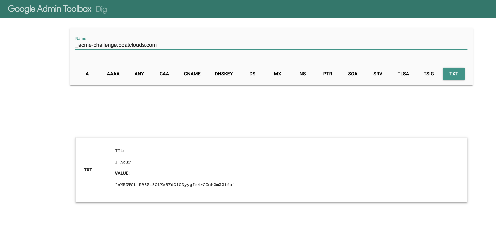
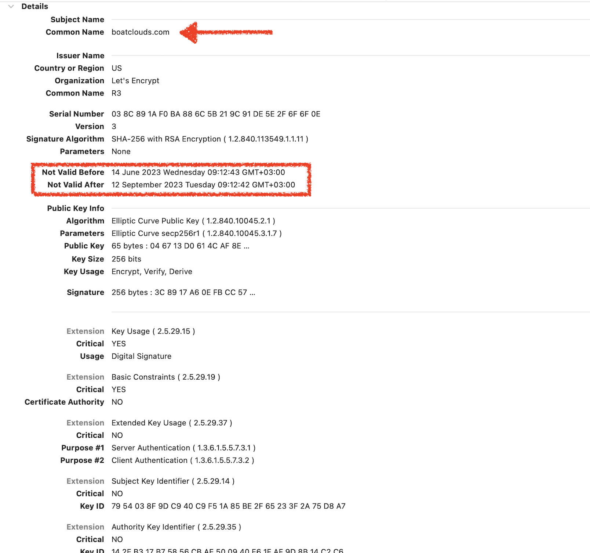

---
sidebar_position: 1
description:  Linux Dağıtımları ve üzerlerindeki Firewall Servisleri
tags:
  - Linux
  - Devops
  - Security
  - Certificates
---  
:::note Başlamadan Önce

**[Lets Encrypt](https://letsencrypt.org)** özellikle web servislerinde kullanılmak üzere sertifika üretebileceğiniz açık kaynak ve ücretsiz bir sertifika otoritesi uygulamasıdır.  Certbot adını veren bir ajan kullanır. Bu ajanı web sunucunuz üzerinde kurup çalıştırabilir veya başka bir ortamda -örneğin kendi bilgisayarınızda- kurup burada sertifika üretip web sunucunuza sertifikaları yükleyebilirsiniz.  

Biz aşağıda certbot ve pluginlerini içeren docker imajını kullanacağız sertifika yaratmak için.  Lets Encrypt'in sitesinde basit bir script üretici koymuşlar.  Web servisinin çalıştığı sunucu üzerinde sertifika üretecekseniz bundan da faydalanabilirsiniz. [LetsEncyrpt](https://certbot.eff.org) 👈️
:::  

## Sertifika Yaratma  

Docker desktop yüklü bilgisayarımızda aşağıdaki komutu çalıştırabilirsiniz.  

````
DVU@MACOS letencrypt % sudo docker run -it --rm --name certbot \
            -v "/dvu/macos/letencrypt/:/etc/letsencrypt" \
            -v "/dvu/macos/letencrypt/:/var/lib/letsencrypt" \
            certbot/certbot certonly --manual --preferred-challenges dns -d boatclouds.com
            
````  
:::note not
docker komutunda -v opsiyonu mount işlevini gerçekleştirir.  İlk yazdığınız path lokal klasörü `:`sonrası ise container içerisindeki klasörün path'ini ifade eder.
:::  

Bu komutu yürüttüğünüzde şunu demek oluyorsunuz.  Ben dns challenge [^1] metodu ile sertifika üretmek istiyorum alan adımda şu.  Buna göre certbot, Letsencrypt CA sunucusuna alan adını ve alan adının dns kayıtlarında kontrol edilecek token'ı gönderiyor. Bu kontroldeki amaç alan adını gerçekten siz mi yönetiyorsunuz bunu anlamak.  

Komutun girilmesi sonrası certbot ajanı şunu ekranda size gösteriyor.  

````
DVU@MACOS letencrypt % sudo docker run -it --rm --name certbot \
            -v "/dvu/macos/letencrypt/:/etc/letsencrypt" \
            -v "/dvu/macos/letencrypt/:/var/lib/letsencrypt" \
            certbot/certbot certonly --manual --preferred-challenges dns -d boatclouds.com
Saving debug log to /var/log/letsencrypt/letsencrypt.log
Requesting a certificate for boatclouds.com

- - - - - - - - - - - - - - - - - - - - - - - - - - - - - - - - - - - - - - - -
Please deploy a DNS TXT record under the name:

_acme-challenge.boatclouds.com.

with the following value:

nHR3TCL_K96ZiZOLKx5FdO1O3yygfr4rGCeh2mX2ifo

Before continuing, verify the TXT record has been deployed. Depending on the DNS
provider, this may take some time, from a few seconds to multiple minutes. You can
check if it has finished deploying with aid of online tools, such as the Google
Admin Toolbox: https://toolbox.googleapps.com/apps/dig/#TXT/_acme-challenge.boatclouds.com.
Look for one or more bolded line(s) below the line ';ANSWER'. It should show the
value(s) you've just added.

- - - - - - - - - - - - - - - - - - - - - - - - - - - - - - - - - - - - - - - -
Press Enter to Continue

Successfully received certificate.
Certificate is saved at: /etc/letsencrypt/live/boatclouds.com/fullchain.pem
Key is saved at:         /etc/letsencrypt/live/boatclouds.com/privkey.pem
This certificate expires on 2023-09-12.
These files will be updated when the certificate renews.

NEXT STEPS:
- This certificate will not be renewed automatically. Autorenewal of --manual certificates requires the use of an authentication hook script (--manual-auth-hook) but one was not provided. To renew this certificate, repeat this same certbot command before the certificate's expiry date.
We were unable to subscribe you the EFF mailing list because your e-mail address appears to be invalid. You can try again later by visiting https://act.eff.org.

- - - - - - - - - - - - - - - - - - - - - - - - - - - - - - - - - - - - - - - -
If you like Certbot, please consider supporting our work by:
 * Donating to ISRG / Let's Encrypt:   https://letsencrypt.org/donate
 * Donating to EFF:                    https://eff.org/donate-le
- - - - - - - - - - - - - - - - - - - - - - - - - - - - - - - - - - - - - - - -

````  

Bu örneğimizde boatclouds.com domaini için sertifika üretmek istediğimizi ilettik.  Certbot ajanı da bize git bu alan adının kayıtlarına txt tipinde bir kayıt ekle ismi "_acme-challenge" ve değeri "u3iqzgabkuu1LyJ1nKYYzi4UWcE-BlOemE8wKUjvncg" olsun dedi.  Bunu alan adınızı yönettiğiniz dns sunucunuza gidip yaptıktan ve "https://toolbox.googleapps.com/apps/dig/#TXT/_acme-challenge.boatclouds.com." vasıtası ile girdiğiniz değerin dns kayıtlarında güncellenmiş olduğunu gördükten sonra  sonra certbot'un beklediği "Press Enter to Continue" kısmını enter tuşu ile geçtiğiniz anda sertifikanız hazır.  

````
DVU@MACOS boatclouds.com % pwd
/dvu/macos/letencrypt/live/boatclouds.com
DVU@MACOS boatclouds.com % ls
README		cert.pem	chain.pem	fullchain.pem	privkey.pem
````  

Bu noktadan sonra lokalimizdeki klasörde oluşan dosyaları alıp web sunucumuza yüklememiz yeterli oluyor.  

**Yaratılan Sertifikan Detayının Ekran Görüntüsü**

 


## Yenileme  

<u>Tüm dijital sertifikalar belirli bir tarih aralığı için verilirler.</u> Dolayısıyla sonlanma tarihlerine yakın yenilenmeleri gerekir.  Lets Encrypt ile ürettiğimiz sertifikayı yenilemek için ise şu komutu crontab'a koymamız yeterli.

```
sudo docker run -it --rm --name certbot \
  -v "/dvu/macos/letencrypt:/etc/letsencrypt" \
  -v "/dvu/macos/letencrypt:/var/lib/letsencrypt" \
  certbot/certbot renew --manual-auth-hook "echo 'This command is not needed for renewals'" --manual-cleanup-hook "echo 'This command is not needed for renewals'" --preferred-challenges dns
```  

Vaktinden önce çalıştırdığımız durumda;

```
DVU@MACOS boatclouds.com % sudo docker run -it --rm --name certbot \ 
  -v "/dvu/macos/letencrypt:/etc/letsencrypt" \
  -v "/dvu/macos/letencrypt:/var/lib/letsencrypt" \
  certbot/certbot renew --manual-auth-hook "echo 'This command is not needed for renewals'" --manual-cleanup-hook "echo 'This command is not needed for renewals'" --preferred-challenges dns
Password:
Saving debug log to /var/log/letsencrypt/letsencrypt.log

- - - - - - - - - - - - - - - - - - - - - - - - - - - - - - - - - - - - - - - -
Processing /etc/letsencrypt/renewal/boatclouds.com.conf
- - - - - - - - - - - - - - - - - - - - - - - - - - - - - - - - - - - - - - - -
Certificate not yet due for renewal

- - - - - - - - - - - - - - - - - - - - - - - - - - - - - - - - - - - - - - - -
The following certificates are not due for renewal yet:
  /etc/letsencrypt/live/boatclouds.com/fullchain.pem expires on 2023-09-12 (skipped)
No renewals were attempted.
- - - - - - - - - - - - - - - - - - - - - - - - - - - - - - - - - - - - - - - -
```


|Link|Açıklaması|
|:---:|:---:|
|Certbot Kullanıcı Rehberi|https://eff-certbot.readthedocs.io/en/stable/intro.html|  

[^1]: Sertifikanın üretilebilmesi içi  LetsEncrypt Sertifika Otoritesi (CA) alan adının gerçekten sizin olup olmadığını doğrulaması gerekir.  Bu doğrulama iki yöntem ile yapılır.**HTTP Challenge :** Bu yöntemde web sunucu üzerinde bir link yaratılır tek kullanımlık bir token olan. CA certbot tarafından kendisine iletilen bu linke bağlanıp token'ı kontrol eder.  Bu kontrol için web sunucunuzun internet üzerinden erişilebilir olması gereklidir.  **DNS Challenge :** Bu yöntemde alan adınıza ilişkin kayıtların bulunduğu dns sunucunuza ulaşımınız olması ve bunun üzerine kayıt yaratabilme yetkiniz olması gerekir. Üstteki maddede yaratılan tek kullanımlık token gibi bir token bu kez dns kayıtlarına eklenir. CA, dns protokolü vasıtası ile dns kayıtlarında bu token'ı gördüğü durumda sertifikayı üretir.


