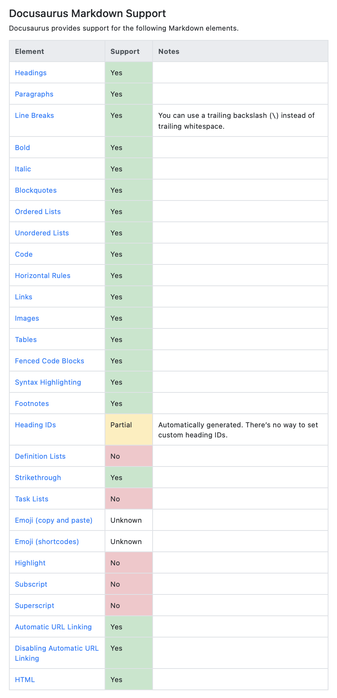

## Markdown Kullanılan Uygulamalar  

Aşağıdaki linkte MD kullanılabilen birçok uygulamayı ve bu uygulamaların MD özellikleri olarak neyi destekleyip neyi desteklemediklerinin tablolarını bulabilirsiniz.

👉 [Markdown Guide](https://www.markdownguide.org/tools)  

Örneğin kullandığımız Docusaurus için hazırlanan tablo şu şekilde;  

