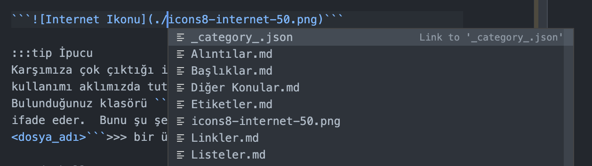

---
sidebar_position: 4
description:  Döküman İçerisinde Link ve Medya Dosyalarını Kullanmayı İnceleyeceğiz
tags:
  - Link
  - Markdown
  - Medya
---  

## Link Ekleme

Döküman içerisinde link vermek için kullandığımız format şudur;

```[Link Etiketi](url)```  

Örnek;  

```[Buraya Tıklayabilirsiniz!](https://www.codepuzz.com)``` >>> [Buraya Tıklayabilirsiniz!](https://www.codepuzz.com)

## İmaj Kullanımı

Yukarıdaki kullandığımız link formatının başına sadece ! ekliyoruz.  

```")```  

Çıktı şu şekilde;  

")  

Burada her zaman internet üzerinde geçerli bir url'e atıfta yaparak link vermek zorunda değilsiniz. Sunucunuz üzerindeki bir klasörde bulunan resim, doküman vb. bir dosyaya da atıf yapabilirsiniz. Örnek;

``````  

:::tip İpucu
Karşımıza çok çıktığı için yerel klasördeki dosyalar için şu kullanımı aklımızda tutalım.  ```./<dosya_adı>``` Bulunduğunuz klasörü ```../<dosya_adı>``` bir üst klasörü ifade eder.  Bunu şu şekilde de abartabiliriz. ```../../<dosya_adı>```  bir üst klasörün üst klasörü şeklinde.  

Vscode kullanıyorsanız burada size bir kolaylık sağlanacağını da şu şekilde görebilirsiniz.  

  

:::

## İmaj üzerine link bırakma

Sayfaya yerleştirdiğiniz bir resimin üzerine tıklandığında bir linke gidilmesini istiyorsanız.  Daha önce resim linki koyarken kullandığımız formatta köşeli parantez içerisine parantez atıp yönlenecek linki veriyoruz.

Örnek;
````
[")](https://en.wikipedia.org/wiki/Markdown) 
````

[")](https://en.wikipedia.org/wiki/Markdown)  

## İmajın Boyutunu Değiştirme 

Bunun için MD'a özel bir durum yok HTML Tag'leri kullanmak zorundayız.

```

```


## Video iliştirme "embed etme"

Markdown'da video linkleri için özel bir durum yok.  Klasik iframe embedleri kullanarak link vermeniz mümkün olabilir.  

Örnek;  

```
<iframe width="560" height="315" src="https://www.youtube.com/embed/34_dRW42kYI" title="YouTube video player" frameborder="0" allow="accelerometer; autoplay; clipboard-write; encrypted-media; gyroscope; picture-in-picture; web-share" allowfullscreen></iframe>
```  

Çıktı;

<iframe width="560" height="315" src="https://www.youtube.com/embed/34_dRW42kYI" title="YouTube video player" frameborder="0" allow="accelerometer; autoplay; clipboard-write; encrypted-media; gyroscope; picture-in-picture; web-share" allowfullscreen></iframe>

## Basit url ve eposta adresi linki verme  

Bunun için adresleri köşeli parantezlerin arasına alıyoruz.  

```<https://www.dvu.com.tr>```  

```<codepuzz@gmail.com>```  

Çıktı;

<https://www.dvu.com.tr>

<codepuzz@gmail.com>   

## Referanslı Link Kullanımı  

Linkleri her zaman yazı içerisinde belirtmek zorunda değiliz.  Örneğin bir paragraf içerisinde birden çok link vermek veya aynı linki birden fazla kullanmak gerekirse bu yazım sırasında karmaşaya neden olabilmekte.  Bunun yerine daha sade ve anlaşılır olması açısında linkleri referans vererek kullanmak daha anlamlı olmaktadır.  Referanslı link yaratma da şu şekildedir;

```[link yazısı][referans belirteci]```  

```[referans belirteci]: url```

Örnek:  

```[Markdown Wiki Sayfası][Wiki]```  

```[Wiki]: https://en.wikipedia.org/wiki/Markdown```

Çıktısı;  

[Markdown Wiki Sayfası][Wiki] 

[Wiki]: https://en.wikipedia.org/wiki/Markdown


:::tip  
Referans belirteci olarak sayılar da kullanılabilir takibi kolaylaştırmak açısından. Örneğin;  

```[Markdown Wiki Sayfası][1]```  

```[1]: https://en.wikipedia.org/wiki/Markdown```  gibi.  
:::  

:::tip  
Belirteçlerin birden fazla sayıda kullanılması da mümkündür. Örneğin;  

```[Markdown Wiki Sayfası][1]```  
```[Markdown Wiki Ana Sayfası][1]```  
```[Wiki Sayfası][1]``` 

```[1]: https://en.wikipedia.org/wiki/Markdown```  gibi.  Tüm bu link verilen yazılar aynı sayfaya yönlendirilmiş olur.  
:::  