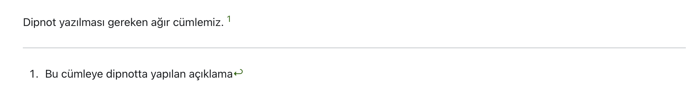

Markdown'da ilk öğreneceğimiz konular temel yazım kuralları (basic syntax) olacaktır. Bu MD(Markdown) yazım kuralları her MD destekleyen editör, uygulama ve servis tarafından tanınır desteklenir.  


## **Temel yazım kuralları (basic syntax)**  

  |Amaç|Yazım Şekli|Çıktı|
  |:---|:---:|:---:|
  |Bold Yapmak|``**Codepuzz**`` veya ``__Codepuzz__``|**Codepuzz**|
  |İtalik Yapmak|``_Codepuzz_`` veya ``*Codepuzz*``| _Codepuzz_|
  |Bold ve İtalik Yapmak|\*\*\_Codepuzz\_\*\*|**_Codepuzz_**  

    > Eğer yazı karakterlerinin rengi, font tipi, büyüklüğünü vb. değiştirmek istiyorsak bu durumda MD bize gerekli seçenekler için yeterli değil.
    >
    >
    >Bunları yapabilmek için  [html tag'lerini](https://www.w3schools.com/tags/) kullanmamız gerekiyor. 
    >Örnek:  
    >
    >`<font size="3" color="yellow">Happy Markdown Day!</font>` >>>  <font size="4" color="red">Happy Markdown Day!</font>  
    >
    >veya altını çizmek için;  
    >
    >`<u>Happy Markdown Day!</u>` >>> <u>Happy Markdown Day!</u> 
    >
    >gibi...  

:::info  
Whatsapp gibi bazı uygulamalarda \_ve \* karakterleri kelime ve cümleleri yine italik ve bold yapmak için kullanılır. Bir nevi universal bir hal almıştır kullanımları. Whatsapp uygulamanızı bir deneyin :smile:  Daha fazla bilgi için [link burada!](https://faq.whatsapp.com/539178204879377)
:::  

## **Genişletilmiş yazım kurallarına (extended syntax) örnekler**

:::warning  
Bunlar her MD editörü tarafından desteklenmeyebilir
:::

  1. **FootNote (Dipnot)**

    Dipnot cümlesi.  Sayfanın en altında belirir.  Dipnot ekleyeceğimiz cümlenin sonuna şu paterni atıyoruz.\[^1\].  Daha sonra dökümanın en altında açıklamasını yazıyoruz.

    \[^1\]: Dipnot Açıklaması.  

    Örnek:

    ```Dipnot yazılması gereken ağır cümlemiz.[^1]```  
    ```[^1]: Bu cümleye dipnotta yapılan açıklama```
    
    Çıktısı şu şekilde;  
  
    
  
  2. **Emoji Kullanımı**

    Gülme efekti yapalım cümle sonuna. `:grinning:` >>> :grinning:

    Buradaki kullandığımız emoji formatı [shortcodes](https://emojibase.dev/shortcodes?) olarak geçiyor. Linkten tablosuna göz atabilirsiniz.

    Dediğimiz gibi her editör tanımak zorunda değil örneğin Vscode preview'da görebilmek için extension gerekiyor.

  3. **Strikethrough (üstünü çizme)**

    ``~~Çiz üstümü.~~`` >>> ~~Çiz üstümü.~~

  4. **Sayfamızın desteklemediği diğer formatlar**

    H~2~O >>> Subscript  
    X^3^ >>> Superscript  
    ==Önemli cümlemiz== >>> Highlight etme  


:::tip ipucu

Markdown için kaçış karakteri backslash'tir `\` . Örneğin iki asteriks işaretini yazmak isterseniz başlarına ``\*\*`` koymalısınız. Koymadığınız durumda bold et olarak algılanır editör tarafından. 

:::

:::tip ipucu

Html tag'lerinin görmezden gelinmesini sağlamak veya editörün yazılanı markdown olarak algılamaması için istediklerinizi backtick \`\` arasına yazabilirsiniz.  Örnek:

\`<b\>backtick arası :)</b\>\`

Çıktısı

`<b>backtick arası :)</b>`
:::  


