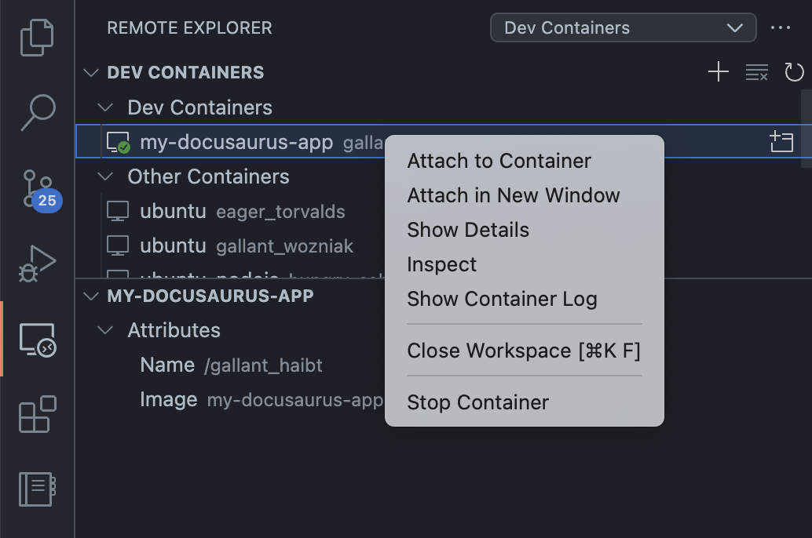

# Başlarken 

Bu sitenin oluşturulması sırasında aşağıda çizimde belirtilmeye çalışılan yapı kullanılmıştır.  Birçok farklı şekilde de kurgulanabilmesine rağmen gerek hızlı geliştirme gerek oluşturulan veri ve sayfaların yedeklenmesi ve gerekse de maliyet unsurları bu yapıyı şimdilik en verimli yapı olarak öne çıkarmıştır.

## Topoloji  

  


:::tip Uygulama önerisi

Diagram çiziminde [draw.io](https://app.diagrams.net) kullanılmıştır.

:::

## Yapının Genel Çalışma Şekli  

Diz üstü bilgisayar üzerinde kurulu olan **[Vscode](https://code.visualstudio.com)** ve **[Docker Desktop](https://www.docker.com/products/docker-desktop/)** uygulamaları geliştirme altyapısı için yeterli olmuştur.  Ide olarak seçilen Vscode'un ve Docker Desktop üzerinde yaratılan container'ın ilişkilendirilmesi VsCode'un [Dev Container](https://code.visualstudio.com/docs/devcontainers/attach-container) extension'ı ile sağlanmıştır.  Bu sayede container'ın dosya sistemine ve shell'ine Vscode içerisinden direk erişim sağlanmıştır.



### Peki container'ı nasıl yarattık!? 

Docker Desktop'u dizüstü bilgisayara kurulumunu yaptıktan sonra ister kendi arayüzünden ister terminal'den uygulamayı yönetebilirsiniz.  

* Önce Ubuntu imajı ile container'ımızı ayağa kaldırdık. (İmajı indirmek için birşey yapmanıza gerek yok. Komut imajı lokalinizde bulamazsa gidip [Docker Hub](https://hub.docker.com/)'a bakacak şekilde çalışır) Aşağıdaki komut container'ı çalıştıracaktır.

```bash
docker run -it -d  -p 3000:3000  ubuntu  /bin/bash  

docker ps #Çalışan container'ları listelemeniz için
CONTAINER ID   IMAGE               COMMAND       CREATED         STATUS         PORTS                    NAMES
e177570b6dd9   ubuntu              "/bin/bash"   2 minutes ago   Up 2 minutes   0.0.0.0:3000->3000/tcp   funny_jang

docker ps - a #Çalışmayan container'ları listelemeniz için

````

:::tip Öğrenilmesi Gerekenler
[Docker komutları hayatı kolaylaştırır.](https://docs.docker.com/engine/reference/commandline/cli/) Üzerinde çalışan bilgisayarın x portunu container'ın y portuna ilişkilendirmek için kullanılan "-p" operatörü veya yine bilgisayardaki bir klasörü container'ın içerisindeki bir klasöre bağlayan "-v" operatörü gibi.  Bunlarla ilgili ayrı bir başlık açacağız.
:::

* Container'ın içerisindeki shell'e düşmek için,

```bash
Hostname@Macos ~ % docker exec -it e177570b6dd9 /bin/bash
root@e177570b6dd9:/# pwd
/
root@e177570b6dd9:/# 
````
* Bu noktadan sonra artık kullanacağınız ubuntu işletim sistemi emrinize amade oluyor.  Hangi web servisini ve uygulamaları kuracaksanız üzerine yükleyip Tcp 3000 portundan çalıştırabilir kendi bilgisayarınızdaki browser'ınızdan http://localhost:3000 adresini çağırarak container'da çalışan web servisine erişebilirsiniz.  
Biz codepuzz için öncelikle container içerisinde [node.js](https://nodejs.org/en) ve sonrasında da CMS olarak kullanacağımız [Docusaurus](https://docusaurus.io/)'un kurulumunu gerçekleştirdik.  

* Container'ınızı ve üzerinde çalıştıracağınız uygulamaları yüklendikten sonra hemen veri girişine veya editleme işlemlerine başlamayın.  Zira container'ınızı imaj olarak henüz başlangıçta kaydetmek sizi bu zamana kadar yaptığınız adımları tekrarlamaktan kurtarır.

```bash

Hostname@Macos ~ % docker stop e177570b6dd9  #container'ımızı durdurduk.
e177570b6dd9  

Hostname@Macos ~ % docker commit e177570b6dd9 imajimin_ismi #container'ımızı imaj olarak kaydettik.
sha256:789ca44655f63e4bc846502fd5e03e3cc751d5428c60712c4e9856a90699dc63

Hostname@Macos ~ % docker images #Kontrol ediyoruz lokaldeki imaj listemizden. Bundan sonra istediğimiz gibi açıp kullanabiliriz.

imajimin_ismi  7 seconds ago   77.8MB                                                           latest                                                 789ca44655f6   

Hostname@Macos ~ % docker run -it -d -p 3000:3000 --name yenicontainerim imajimin_ismi #Yeni imajımla içini editleyeceğim yeni bir container açabiliriz artık
f34fa7345ad4496d1cf15c71ecec5eff5168a37e1a11db890445ced10c905482
```

* Bundan sonrası adım ise container'ı Vscode ile ilişkilendirip container'ın içerisinde kendi istediğinize göre içerik yaratmak ve format değişikliklerine gitmektir.  

## Repo Seçimi

Uygulama geliştirirken üreteceğiniz veya değiştireceğiniz veriyi, sistemsel dosyaları scriptleri vs. mutlaka bir yerde tutmanız gerekiyor. Geleneksel yazılımcılar için bu genelde çalışılan bilgisayarın bir klasörü ve bir harici disk oluyor.  Eğer akıllara gelirse Github veya Gitlab'taki bir repoya konduğu da oluyor.

Biz Codepuzz'da geliştirme yapılan lokalde - üzerinde çalışılan bilgisayar - veri tutmayacağız. Elbette container çalıştığı sürece dosyalarımız içerisinde duracak ancak dediğimiz gibi üzerinde çalıştığımız bilgisayarın dosya sistemi içerisinde değil.

Peki altyapımızda canlı sistem için kullandığımız AWS Amplify ile testbed olarak kullandığımız Docker Desktop container arasındaki senkronizasyonu nasıl sağlayacağız.  

İşte burada [Github](https://github.com) ve Git protokolü devreye giriyor.  

Yapacağımız işle gayet basit aslında Vscode'umuzun ve container içerisindeki ilgili dizinimizi Git şemsiyesi altına alıyoruz. Ve yaptığımız değişiklikleri eklentileri Github'ta açtığımız repo üzerine push -yükleme- ediyoruz. 

Aws Amplify'da ise uygulama yaratırken bize hangi repodan uygulamanın dosyalarını çekeceğimizi soruyor. Dolayısıyla Aws'e de github'daki repomuzu hedef gösteriyoruz o da gidiyor repoyu "pull" -indirme- ediyor.

Sonuç itibari Github herkes için bir kavşak noktası oluyor.  Dosyalarımızın güvenliği, yedeklenmesi, çeşitli sistemlere entegre edilmesinde tamamen Github'a sırtımızı dayamış oluyoruz.

Zaman geçtikçe burada bahsi geçen konuları detaylandıracağız.   


_**Güncelleme 1 - 29 Mayıs 2023**_
***

Repo ayarları hariç olmak üzere hızlıca docusaurus'u ayağa kaldırmak için aşağıdaki docker compose dosyasını da kullanabilirsiniz.  
Ubuntu container içerisine node.js ve docusaurus kurulu olan imaj [Docker Hub](https://hub.docker.com/r/pytonish/dvu)'a yüklenmiştir.  Hazır olan imajı bilgisayarınıza indirip container olarak çalıştırmak için yapmanız gerekenler;

1. Aşağıdakileri bir text dosyasına yapıştırın.  

    ```
    version: '3'
    services:
      dvu:
        image: pytonish/dvu
        working_dir: /codepuzz
        ports:
          - 3003:3000
        command: bash -c "cd /codepuzz && npx docusaurus start --host 0.0.0.0 & tail -f /dev/null"  

    ```
2.  Text dosyasını docker-compose.yml olarak kaydedin.  

3. Terminal uygulamanızı açıp ve dosyayı kaydettiğiniz klasörü altına gidip şu komutu yürütün.

    ```docker-compose up -d ```  

4. Tarayıcınızda http://localhost:3003 adresini kullanarak artık CMS arayüzünüze ulaşabilirsiniz.